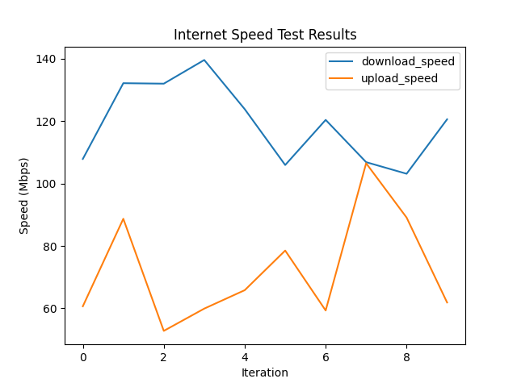

# Speedtest Workflow

This is a Temporal Implementation of how to monitor your network speed with Temporal.



## Run the program

```bash
poetry run python run_speed.py
poetry run python run_workflow.py
```
